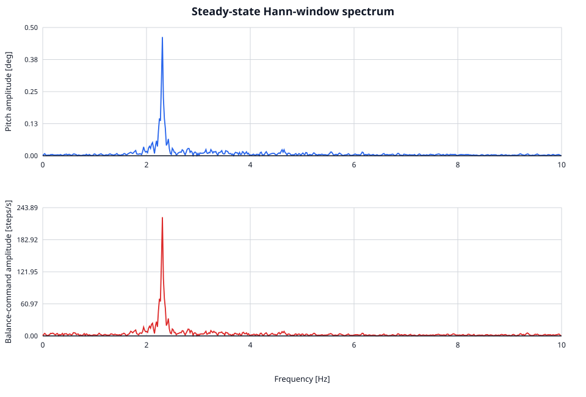

# Clean Wood-Floor Neutral Balance — 2026-07-19

[Back to the hardware data archive](../../README.md)

[Analysis workflow](../../../doc/testing/telemetry_analysis_cli.md) · [Manifest](manifest.json)

This Raspberry Pi capture records the robot balancing undisturbed on a wooden floor with zero
joystick target. At capture and simulator-comparison time, hardware and simulator used identical
PID values (SHA-256
`b1a7ec6663c111ce4311944d1ca2077ca8370d241d32f6878e8c2015e2a7830d`). The first 10 seconds are
treated as release and settling; steady-state statistics and spectra use `t >= 10.0 s`.

Later working-tree PID edits are not represented by this session or its simulator comparison.
The digest above identifies the historical run; compare it with the current `pid.conf` digest before
describing any result as current verification.

## Main findings

The run is bounded and nearly stationary after release, but it does not converge to a quiet neutral
equilibrium. Pitch and balance command share a coherent **2.3065 Hz** component (period 0.4336 s),
consistent with a closed-loop rocking limit cycle.

| Metric | Release/full run | Steady state (`10.00–62.46 s`) |
| --- | ---: | ---: |
| Peak absolute pitch | 3.062° | 0.964° |
| Pitch RMS | 0.447° | 0.388° |
| Pitch p95 absolute | 0.671° | 0.655° |
| Pitch-rate RMS | 8.84°/s | 8.80°/s |
| Balance-command RMS | 328 SPS | 208 SPS |
| Net wheel motion | +2382 steps | −37 steps (about −3.6 mm) |
| Controller/actuator faults | 0 | 0 |
| Saturation | Pitch/rate flags from 0.102–0.682 s | None |

The release starts near +2.9° and rolls about 23 cm while catching itself. From 10 seconds onward,
the wheel position stays within a roughly 12 mm range and has negligible net drift. This is a
bounded oscillation, not the slow runaway seen in the older hardware session.

## Fourier result

The spectrum uses the complete 52.45-second steady interval. Signals are linearly interpolated to a
uniform 100 Hz grid, linearly detrended, multiplied by a Hann window, and transformed into a
single-sided amplitude spectrum. Bin width is 0.01906 Hz.

| Signal at 2.3065 Hz | Single-sided amplitude |
| --- | ---: |
| Fused pitch | 0.4668° |
| Filtered pitch rate | 6.649°/s |
| Balance command | 225.8 SPS |
| Raw accelerometer pitch | 0.6532° |

The same narrow peak in fused pitch and controller command is stronger than any other isolated
pitch component by more than 13×. The tone alone corresponds to roughly 0.33° RMS, explaining most
of the 0.388° steady pitch RMS. Raw accelerometer pitch also contains broad vibration/linear-
acceleration energy (16.79° RMS), which should not be interpreted as sensor noise alone.

## Simulator comparison

The simulator comparison used the same PID digest shown above. The ideal neutral simulator remains
exactly at zero. Its realistic push scenarios recover to much smaller tails:

| Case | Peak pitch | Last-2-s pitch RMS | Outcome |
| --- | ---: | ---: | --- |
| Simulator, ideal neutral | 0.000° | 0.000° | Exact equilibrium |
| Simulator, realistic 1 N / 100 ms push | 0.303° | 0.051° | Recovers |
| Simulator, realistic 3 N / 100 ms push | 0.862° | 0.026° | Recovers |
| Hardware, neutral release | 3.062° | 0.384° | Bounded 2.3065 Hz limit cycle |

The release is not a calibrated force input, so peak values are contextual rather than a plant-fit
comparison. The useful mismatch is in the tail: the simulator does not reproduce the persistent
hardware mode. Compared with the older session's selected four-second quiet window, this run has
2.11× pitch RMS and 1.91× command RMS even though it is much cleaner at the session level because it
never runs away.

## Files

| File | Contents |
| --- | --- |
| [`steady_state_10s_400hz.csv`](steady_state_10s_400hz.csv) | Last 10 seconds at full rate, reduced to 22 diagnostic fields |
| [`steady_state_100hz.csv`](steady_state_100hz.csv) | Entire steady interval at 100 Hz; preserves content below the 50 Hz Nyquist limit |
| [`steady_state_spectrum.csv`](steady_state_spectrum.csv) | 0–20 Hz pitch, pitch-rate, command, and accelerometer amplitudes |
| [`manifest.json`](manifest.json) | Source/artifact checksums, statistics, transform method, and dominant peaks |

The derived files are frozen, checksum-bound analysis outputs. The one-off extraction and plotting
script was intentionally discarded after the artifacts and transform method were verified.

Telemetry caveats: hardware `left_target_sps`, `right_target_sps`, and `imu_timestamp_us` are zero
throughout this capture. Hardware-only plant-truth columns are also zero. Use `u_sps`, applied motor
feedback, and actual step counters instead; do not use this session for trajectory fitting.
