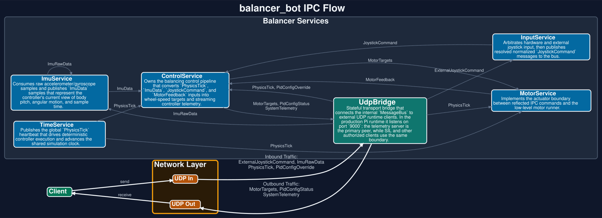

# balancer_bot IPC Reference

> Auto-generated by `generate_balancer_docs` using GCC trunk reflection.

## Overview

This document describes the current balancer SIL/IPC surface: the UDP bridge, the three service wrappers, and the fixed-size payload structs exchanged across the message bus.

The current runtime flow is straightforward:

1. Python tests inject `JoystickCommand` and `ImuData` through `UdpBridge`.
2. `ControlService` consumes those inputs and publishes `MotorTargets` plus `SystemTelemetry`.
3. `MotorService` consumes `MotorTargets`, and `UdpBridge` relays outbound traffic back to Python.



## Components

### `ImuService`

- Publishes: `ImuData`
- Subscribes: _None_

### `ControlService`

- Publishes: `MotorTargets`, `SystemTelemetry`
- Subscribes: `ImuData`, `JoystickCommand`

### `MotorService`

- Publishes: _None_
- Subscribes: `MotorTargets`

### `UdpBridge`

- Publishes: `StateRequest`, `MotorSequence`, `KinematicsRequest`, `PowerRequest`, `ThermalRequest`, `AutoDriveCommand`, `EnvironmentData`, `SensorRequest`, `RevisionRequest`, `JoystickCommand`, `ImuData`
- Subscribes: `Log`, `StateData`, `KinematicsData`, `PowerData`, `ThermalData`, `EnvironmentAck`, `AutoDriveStatus`, `EnvironmentRequest`, `EnvironmentData`, `SensorAck`, `RevisionResponse`, `ImuData`, `MotorTargets`, `SystemTelemetry`

## Message Payloads

### `MsgId::ImuData`

> Fused IMU sample published by the IMU service and accepted by the SIL harness.

- Numeric ID: `3000`
- Payload type: `ImuSamplePayload`
- Wire size: `64` bytes
- Published by: `ImuService`, `UdpBridge`
- Consumed by: `ControlService`, `UdpBridge`

| Field | C++ Type | Python Type | Bytes | Offset |
|---|---|---|---:|---:|
| `pitch_rad` | `double` | `float` | 8 | 0 |
| `acc` | `std::array<double, 3>` | `list[float]` | 24 | 8 |
| `gyr` | `std::array<double, 3>` | `list[float]` | 24 | 32 |
| `timestamp_us` | `uint64_t` | `int` | 8 | 56 |

### `MsgId::JoystickCommand`

> Normalized joystick command injected by Python tests or the runtime input layer.

- Numeric ID: `3001`
- Payload type: `JoystickCommandPayload`
- Wire size: `8` bytes
- Published by: `UdpBridge`
- Consumed by: `ControlService`

| Field | C++ Type | Python Type | Bytes | Offset |
|---|---|---|---:|---:|
| `forward` | `float` | `float` | 4 | 0 |
| `turn` | `float` | `float` | 4 | 4 |

### `MsgId::MotorTargets`

> Wheel speed targets emitted by the controller in steps per second.

- Numeric ID: `3002`
- Payload type: `MotorTargetsPayload`
- Wire size: `8` bytes
- Published by: `ControlService`
- Consumed by: `MotorService`, `UdpBridge`

| Field | C++ Type | Python Type | Bytes | Offset |
|---|---|---|---:|---:|
| `left_sps` | `float` | `float` | 4 | 0 |
| `right_sps` | `float` | `float` | 4 | 4 |

### `MsgId::SystemTelemetry`

> Compact controller telemetry streamed out over UDP for SIL observation.

- Numeric ID: `3003`
- Payload type: `SystemTelemetryPayload`
- Wire size: `8` bytes
- Published by: `ControlService`
- Consumed by: `UdpBridge`

| Field | C++ Type | Python Type | Bytes | Offset |
|---|---|---|---:|---:|
| `core_cpu_usage` | `float` | `float` | 4 | 0 |
| `loop_time_us` | `float` | `float` | 4 | 4 |

## Regenerating

```bash
cmake -S . -B build
cmake --build build --target balancer_docs
```
