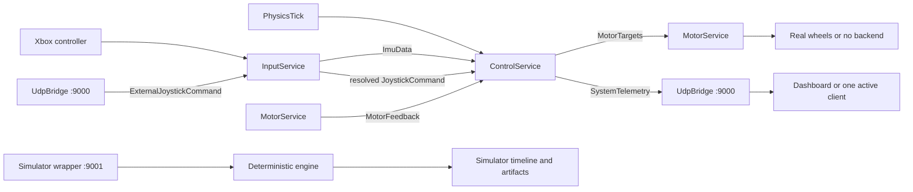

# Project overview

`balancer_bot` is both a physical self-balancing robot and a controlled experiment in making the
same balance logic observable in hardware, software-in-the-loop (SIL), and deterministic
simulation. The important idea is not that these modes are identical; it is that they share the
service-level control path where that comparison is useful.

## The mental model

The balance loop is driven by an explicit `PhysicsTick`, not by whichever sensor or network packet
happens to arrive next.

The source of that tick depends on the mode: hardware uses `TimeService`, SIL receives ticks from
its external Python client, and the direct simulator advances its own deterministic timeline. The
control services still consume the same tick-shaped input in all three cases.

In the physical runtime, the IMU and motor runner are real. In SIL, Python supplies the clock and
sensor inputs while the services and UDP bridge remain real. In the direct simulator, one process
runs the estimator, controller, motor/pulse model, and plant model on a deterministic timeline.

## Three runtime modes and the test binary

| Mode | Executable | Inputs and hardware | Outputs | Best for |
| --- | --- | --- | --- | --- |
| Hardware | `balancer_pi` | Real IMU, stepper motors, `TimeService`, and optional Xbox input | Wheel motion, controller telemetry through UDP port `9000` | Running and cautiously validating the robot |
| SIL | `sil_app` plus a Python SIL client | Python injects `PhysicsTick`, `ImuRawData`, and `ExternalJoystickCommand`; no hardware IMU, plant, or motor runner | `MotorTargets` and `SystemTelemetry` through UDP port `9000` | Exercising the production service/message-bus/UDP boundary |
| Direct simulator | `balancer_simulator` | Deterministic engine with production estimator/control path, motor model, pulse scheduler, and plant | Scenario telemetry and artifacts under `build/sim` | Stability, disturbance, transfer, and repeatable software experiments |
| C++ test binary | `balancer_tests` | In-process fixtures and simulator components | Test results through CTest | Fast checks of math, services, timing, and invariants |

`balancer_simulator` can expose its scenario-control wrapper on UDP port `9001`, but that is not the
production `UdpBridge` on port `9000`. The simulator can also run direct in-process summaries and
catalog queries; the [testing strategy](testing/strategy.md) describes the supported validation
workflows.

## Where each runtime surface starts

The runtime modes share service-level concepts, but they are assembled at different entry points:

| Surface | Composition entry point | Owns or supplies |
| --- | --- | --- |
| Hardware | `src/services/main/main.cpp` → `src/services/main/control_app.h` | Raspberry Pi clock, IMU reader, input service, motor runner, and production UDP bridge |
| SIL | `tests/sil_app.cpp` | Production service/message-bus path and UDP bridge; an external Python client supplies ticks and sensor/command inputs |
| Direct simulator | `tests/simulator_main.cpp` and `tests/simulator/` | Deterministic time, simulator wrapper, motor/pulse model, plant, scenarios, and artifacts |
| In-process tests | `tests/*_test.cpp` and simulator support | Direct service and engine fixtures without a standalone runtime boundary |

This is a source map for navigation, not a claim that the modes should be merged. The differences in
clock, hardware backend, plant, transport, and artifact ownership are part of what each mode proves.
The plant audit, simulator tuner, and fuzz harnesses are validation tools around these surfaces, not
additional runtime modes.

The practical distinction between SIL and the direct simulator is:

- SIL contains the production service boundary but no plant. It needs an external client to provide
  time, IMU data, and commands.
- The direct simulator contains the plant and advances time itself. It is where closed-loop
  stability and transfer behavior are evaluated.

In this documentation, `sil_app` means the C++ SIL runtime. The Python SIL client is the external
driver/test process that registers with it, injects inputs, and observes outputs.

## The control path in plain language

1. `TimeService` publishes `PhysicsTick` at the control cadence. The tick carries elapsed time and
   a monotonic timestamp.
2. `ImuService` turns raw accelerometer and gyroscope samples into the controller-facing `ImuData`
   estimate. In SIL, raw samples are injected over UDP instead of read from hardware.
3. `InputService` polls the Xbox controller and publishes the resolved joystick intent. An external
   UDP client injects `ExternalJoystickCommand` through the normal bus; the Xbox source has priority
   when available, otherwise the external command is accepted for a short watchdog interval.
4. `ControlService` combines the tick, attitude estimate, joystick intent, and motor feedback to
   produce `MotorTargets` and `SystemTelemetry`.
5. `MotorService` sends targets to the real motor runner when one exists and publishes completed-step
   feedback. Without hardware, it keeps the service path alive with a null backend.
6. `UdpBridge` forwards the selected external messages to or from the one active UDP peer.

The message bus is synchronous and in-process: publishing immediately invokes the subscribed
services. It is not a background queue, discovery system, or second scheduler. The lower-level
dispatch details are in [Runtime architecture](arch/runtime.md) and [MessageBus and UDP Bridge](arch/message_hub.md).

## Messages and boundaries

The names below are enough to follow most diagrams and logs:

| Message | Meaning | Boundary |
| --- | --- | --- |
| `PhysicsTick` | The control clock and elapsed `dt` | Internal in hardware; injectable through UDP for SIL |
| `ImuRawData` | Robot-axis accelerometer and gyroscope sample before pitch estimation | Injectable through UDP; consumed by `ImuService` |
| `ImuData` | Filtered pitch, pitch rate, and validity for the controller | Internal-only |
| `JoystickCommand` | Normalized forward and turn intent | Resolved internal stream published by `InputService` |
| `ExternalJoystickCommand` | Normalized external forward and turn request | Injectable through UDP and consumed by `InputService` |
| `MotorTargets` | Left/right wheel targets in steps per second | Published by the controller; visible to the UDP peer |
| `MotorFeedback` | Completed steps, applied command, timing, and actuator fault state | Internal-only controller feedback; hardware uses real completed steps, SIL uses a commanded-speed proxy, and simulation uses quantized simulated steps |
| `SystemTelemetry` | Controller, estimator, command, feedback, saturation, and fault observations | Streamed to the UDP peer and dashboard |
| `PidConfigOverride` / `PidConfigStatus` | Complete session-only controller snapshot and its validation result | Dashboard to `ControlService` and status back through the UDP peer; never persisted |

The production UDP bridge accepts only its authorized ingress messages and checks payload sizes. A
client first sends a datagram to register; the most recent sender becomes the active peer, replacing
the previous sender. A zero-message registration datagram is what the repository's Python client
uses. The bridge then sends outbound messages only to that peer. If no peer is registered, outbound
telemetry has nowhere to go, but peer presence is not the motor safety interlock.

The two UDP endpoints have different jobs:

| Endpoint | Component | Main ingress | Main egress | Meaning |
| --- | --- | --- | --- | --- |
| `9000` | `UdpBridge` in `balancer_pi` or `sil_app` | `PhysicsTick`, `ImuRawData`, `ExternalJoystickCommand`, `PidConfigOverride` | `MotorTargets`, `SystemTelemetry`, `PidConfigStatus` | Production runtime boundary and SIL transport |
| `9001` | `balancer_simulator` scenario wrapper | `SimStartRun`, `SimStopRun`, optional `JoystickCommand` | `SimulatorTelemetry`, `SimStartAck`, `SimRunDone` | Control and observe a deterministic plant run |

The simulator's `SimulatorTelemetry` contains the controller telemetry plus plant and actuator
observations. It is not a second production bridge. The exact IDs and payloads are in the
[generated protocol](ipc/protocol.md).

The bridge adopts a sender as the active peer before it checks whether the datagram is long enough,
authorized, or correctly sized. In practice, a malformed or unauthorized packet can therefore
replace the return address, but it is not published to the internal bus and does not become a valid
control input.

The bridge's external contract is deliberately smaller than the internal bus. The generated
[IPC protocol](ipc/protocol.md) is the authoritative place for exact IDs, field layouts, wire sizes,
and the complete service graph. “Reflected” means the C++ message and service declarations carry
compile-time metadata; the build uses that metadata to generate the Python bindings and protocol
documentation. A reader interested only in system behavior can defer that detail.

## Safety and confidence boundary

The controller locally stops commanding motion when it has no valid IMU, sees stale or future IMU
data, detects fallover, or receives an actuator fault. It resets dynamic command state and publishes
the fault through telemetry. This behavior does not depend on the network peer.

After a fallover, the balance state re-arms only when the local controller's pitch and rate are back
within its re-arm limits, unless a nonzero forward command explicitly requests recovery. The current
limits are 10 degrees of pitch and 30 degrees per second; the implementation is in
[`RateControllerCore`](../src/services/control/rate_controller_core.cpp).

For passive IMU or physical-pendulum measurements, use a copied PID configuration with
`controller_enabled = 0`. The hardware runtime leaves both steppers de-energized, does not create a
motor runner, and continues the IMU/controller/telemetry path for observation. Follow the
[Raspberry Pi guide](Running_on_Pi.md) for the restrained measurement procedure.

Simulation acceptance is evidence about the software model and control behavior under specified
scenarios. It is not proof that the current gains or plant parameters are safe on the physical
robot. The [current status](status.md) records that distinction and the remaining hardware work.

## Configuration and build facts

- `pid.conf` is the checked-in default profile used by both `balancer_pi` and the simulator.
- Simulator-oriented flows can override the path with `BALANCER_PID_CONF`; tuning tools write
  candidate profiles under `build/sim` rather than silently changing hardware configuration.
- `pytest --build` is the standard host build/test gate. The [Testing Strategy](testing/strategy.md)
  explains the individual layers and artifacts.
- Host compiler, Python, Graphviz, and generated-output prerequisites are collected in the [host
  setup guide](host_setup.md).
- `./build_cmake OFF` is the Raspberry Pi cross-build path. Cross-builds do not regenerate the
  host-only reflection artifacts.

## Where to go next

- Read [Runtime architecture](arch/runtime.md) for service ownership and the production/SIL/simulator boundaries.
- Read [Testing strategy](testing/strategy.md) for what each validation layer proves.
- Read [Control and plant model](arch/control_plant.md) for equations and controller/plant mapping.
- Read [Control and simulator notes](notes/control_and_simulator.md) for validation scenarios and artifact interpretation.
- Read [IMU attitude design](arch/imu_attitude_design.md) for coordinate conventions and estimator limits.
- Read [Running on Raspberry Pi](Running_on_Pi.md) only when you need physical deployment or bring-up.
